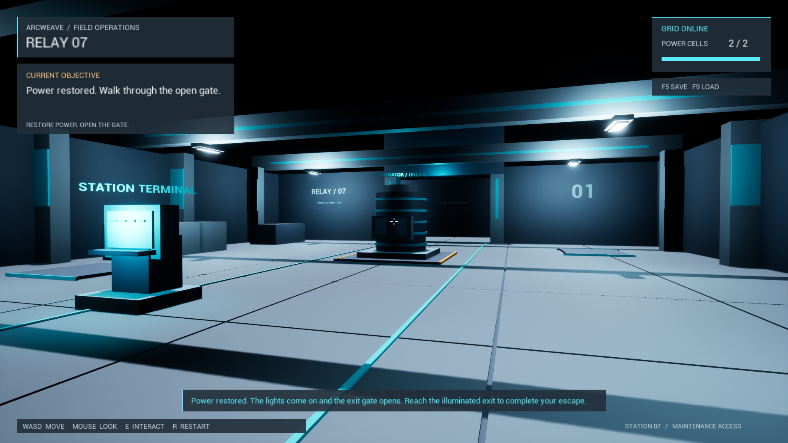

# Arcweave Unreal Quest Example

A C++ Unreal sample where Arcweave drives a world objective: accept a task, collect power cells, restore a generator, and reach the exit. The same Arcweave board is playable in browser Play Mode and supplies the game's quest logic and interface text.



[Play in your browser](https://arcweave.com/app/project/MWEZgMb62g/play) · [Explore the Arcweave project](https://arcweave.com/app/project/MWEZgMb62g) · [Import your own copy](docs/narrative.md#import-your-own-copy)

## Run

Requires **Windows**, **Unreal Engine 5.6.1**, **Visual Studio 2022** with Game development with C++, **MSVC 14.38**, a Windows SDK, **Git**, and **Git LFS**.

```powershell
git lfs install
git clone --recurse-submodules https://github.com/arcweave/arcweave-unreal-quest-example.git
cd arcweave-unreal-quest-example
git lfs pull
powershell -ExecutionPolicy Bypass -File Scripts/build.ps1 -Task Editor
```

Open `ArcweaveQuest.uproject` and press **Play**. Use **Play → New Editor Window (PIE)** for a separate game window, or launch directly:

```powershell
powershell -ExecutionPolicy Bypass -File Scripts/build.ps1 -Task Play
```

The game runs offline from the bundled narrative export; no API key is needed. The Arcweave plugin is pinned to [v2.2.0](https://github.com/arcweave/arcweave-unreal-plugin/releases/tag/v2.2.0) as a Git submodule. Run one game/PIE instance per engine process because the plugin uses a shared engine subsystem.

## Play

| Control | Action |
| --- | --- |
| WASD / mouse | Move / look |
| E | Interact with the nearby object you are looking at |
| F5 / F9 | Save / load the checkpoint |
| R | Restart the mission; keep the saved checkpoint |
| Shift+F1 | Release the mouse in PIE |

Use the terminal, find both cells, activate the generator, then walk through the gate. Try interactions out of order to see Arcweave's conditions and feedback.

To try save/load, save after collecting one cell, finish the mission, then load. The quest, pickups, gate, lighting, and player position return to the saved state. There is one checkpoint slot, which survives closing the game. Updating the narrative export makes existing saves incompatible.

## Develop

Arcweave owns progression, objectives, feedback, prompts, and labels. C++ handles movement, physical interactions, world effects, and file persistence. This is a single-player Windows example.

- [Narrative structure, C++ integration, and editing your own copy](docs/narrative.md)
- [Build options, tests, and packaging](docs/development.md)
- [Local verification](docs/verification.md)

## License

Original sample code and authored narrative are available under the [MIT license](LICENSE). Unreal Engine and bundled dependencies retain their own terms; see [dependency notices](THIRD_PARTY_NOTICES.md).
