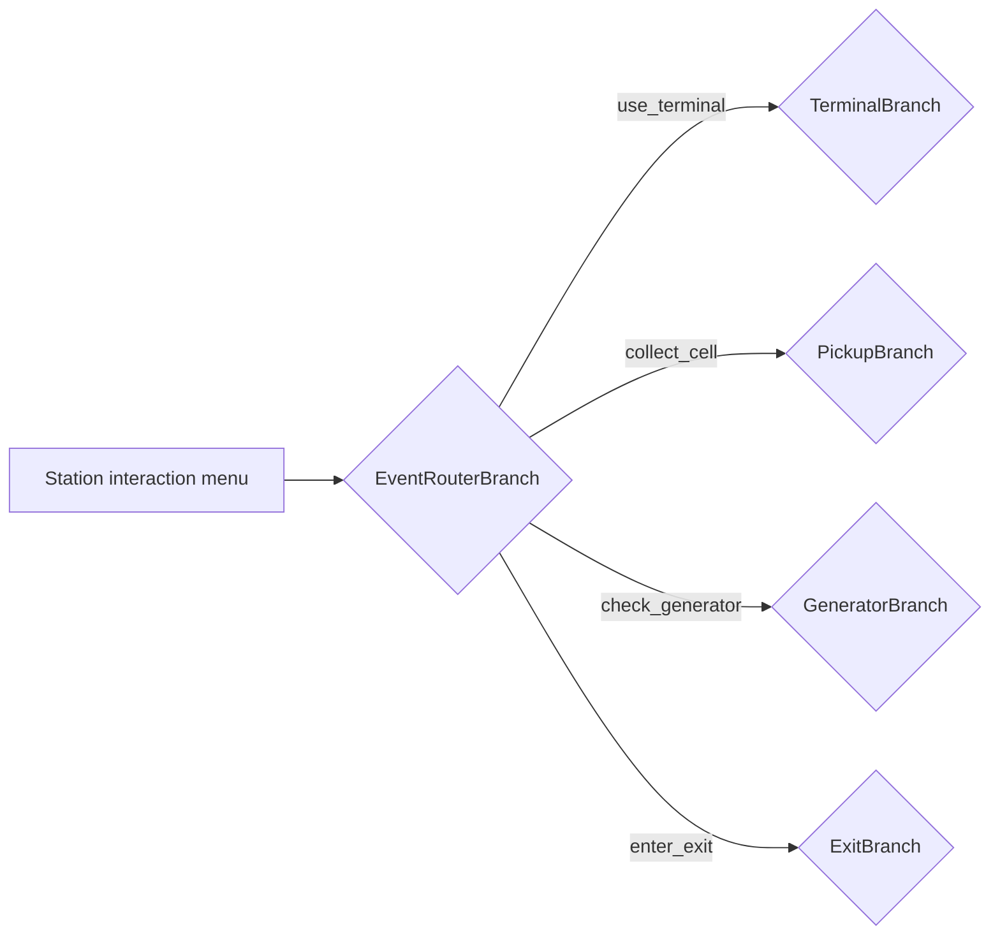
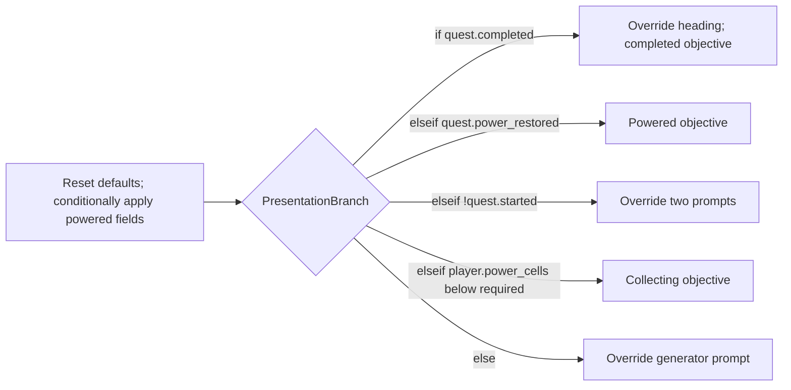

# Restore Power narrative

Open [Restore Power — Unreal C++ Quest Sample](https://arcweave.com/app/project/MWEZgMb62g) in [workspace Z7gAR6XY](https://arcweave.com/app/workspace/Z7gAR6XY/projects). Access requires permission to the workspace or project. The bundled export runs locally without an API key.

Arcweave owns quest progression, feedback, objectives, interaction prompts, and station labels. Unreal supplies physical events and implements two authored world commands. The single **Restore power · playable quest** board contains the station menu, event router, four interaction lanes, inventory query, and objectives/UI path. The complete mission is playable in Arcweave Play Mode and drives the Unreal level from the same conditions and state changes. Four component folders separate **State**, interaction **Inputs**, engine **Actions**, and **UI** strings.

## Play Mode and Unreal

Open [Play Mode](https://arcweave.com/app/project/MWEZgMb62g/play) at **Station · choose an interaction**. The menu offers seven choices:

| Choice | Path |
| --- | --- |
| **Check inventory** | Jumper to the current inventory, then **Back to station**. |
| **Check current objective** | Jumper to the objectives/UI path, then **Back to station**. |
| **Use the terminal** | Terminal response, then return to Station. |
| **Collect cell A** / **Collect cell B** | Pickup response, then return to Station. |
| **Check the generator** | Generator response, then return to Station. |
| **Enter the exit** | Denied: return to Station. Completed: end the playthrough. |

Inventory and objective checks are optional: they read current progress without advancing the quest or changing the latest event inputs. Try denied interactions before accepting the task, repeat a pickup, restore power, and complete the escape in the same playthrough. Play Mode's restart control restores authored defaults; no Debugger setup is needed.

The station menu is the project starting element. Its first two connections are query choices with visible labels and no Arcscript assignments; each targets a jumper. The other five labels supply `game_event.type` and `game_event.cell_id` before targeting the same event router. For example, the cell A label sets these inputs in separate code blocks:

```arcscript
game_event.type = "collect_cell"
```

```arcscript
game_event.cell_id = "cell_a"
```

Play Mode uses the selected interaction label's values to evaluate the destination branch and commits those changes when the choice is selected. Unreal already knows which physical interaction occurred: it writes the same inputs and finds the menu's common branch destination, skipping the query jumpers and executing no menu labels. The menu is the only element with multiple outgoing connections; every branch condition still has one output.


All paths share one board. Four local return jumpers serve the terminal, pickup, generator, and denied-exit outcomes. The successful and already-completed exit elements have no outgoing connections. Inventory has one return jumper, and each of the five objective outcomes has its own nearby return jumper. With the menu's two query jumpers, the board has twelve jumpers. Every return targets the current station menu.

The native world-event runner resolves its return jumper and stops **before** executing the station menu, or ends at a completed-exit element. `RunEvent` then calls `RefreshPresentation()` once in either case. Presentation also stops before executing the menu. Unreal's HUD therefore updates automatically after every interaction; it never requires selecting **Check inventory** or **Check current objective**. Play Mode returns control to the menu so the player can choose whether to check progress or interact again. Individual automatic paths remain acyclic up to the menu boundary.

Collection progress is authored state, so Play Mode needs no replacement C++ handler: an accepted pickup marks its cell and increments the inventory in Arcscript. Engine action references handle physical collection and the gate when run in Unreal; Play Mode shows the authored outcomes without rendering those physical effects. There is no simulation flag, additional board, or separate preview copy of the quest state.

## World events

Unreal writes the two current interaction inputs on **Inputs → Game event**, then uses `GetArcweaveProjectData().StartingElementId` to find the station menu and its common `EventRouterBranch` destination among the five interaction connections. The two query connections target jumpers and are skipped. There is no fixed C++ binding for the station entry. Each of the router's four conditions connects directly to that interaction's condition branch. The router has no else condition: an empty or unsupported event type supplied by Unreal reaches the existing integration error path without running a gameplay branch. In Play Mode, the selected interaction label supplies a supported event before the router is evaluated. Responses return to Station through their group's local jumper; completed-exit responses end the playthrough.

| Event router condition | Destination | Authored behavior |
| --- | --- | --- |
| **IF** `game_event.type == "use_terminal"` | `TerminalBranch` | Checks completed, powered, and accepted states in order. Otherwise, **Terminal · accept task** (`StartElement`) sets `quest.started = true`. Repeated interactions have their own feedback. |
| **ELSE IF** `game_event.type == "collect_cell"` | `PickupBranch` | Checks the selected cell's shared collected state, then task acceptance. One accepted-pickup element marks that cell, increments `player.power_cells`, renders the updated count, and requests `collect_cell`. |
| **ELSE IF** `game_event.type == "check_generator"` | `GeneratorBranch` | Checks already powered, task not accepted, and sufficient cells in order. **Generator · restore power** (`SuccessElement`) sets `quest.power_restored = true` and requests `open_gate`. Unreal reflects that state in the station lighting. Other outcomes give guidance. |
| **ELSE IF** `game_event.type == "enter_exit"` | `ExitBranch` | Gives repeat feedback if completed; sets `quest.completed = true` only when power is restored; otherwise denies exit. Successful and already-completed responses end Play Mode; a denied exit returns to Station. |



Every condition row has exactly **one outgoing connection**. The router’s `collect_cell` condition connects directly to `PickupBranch`, whose rows are:

| Pickup condition | Single destination |
| --- | --- |
| **IF** the selected cell's `collected` flag is true | `DuplicatePickupElement`: “This power cell has already been collected.” |
| **ELSE IF** `!quest.started` | `PickupTerminalRequiredElement`: “Use the terminal to accept the task first.” |
| **ELSE** | `PickupActionElement`: updates the selected cell and inventory, displays the updated count, and requests `collect_cell`. |

The pickup condition compares `game_event.cell_id` with `cell_a` or `cell_b` and reads the corresponding component's `collected` flag. Arcweave owns the check order, collection permission, unique collection state, and response. Both new and repeated pickup requests use the same `collect_cell` event; there is no duplicate-cell event or externally supplied duplicate flag. Unreal's physical pickup IDs match those used by the two menu choices.

Unreal startup and restart load fresh project defaults and execute the entry marked `entry_point = objectives_ui` directly, stopping before the menu. The initial objective is **Use the terminal to begin.** They do not execute a world event, emit an arrival message, or accept the task. Browser Play Mode starts at the station menu and lets the player choose the first interaction.

## Game event inputs

The **Inputs** folder contains the **Game event** component, with custom ID `game_event`. These attributes describe the current request, independently of quest progress:

| Attribute | Type / default | Meaning |
| --- | --- | --- |
| `type` | Plain string / empty | The interaction being handled: `use_terminal`, `collect_cell`, `check_generator`, or `enter_exit`. |
| `cell_id` | Plain string / empty | The selected pickup: `cell_a` or `cell_b`; empty for other interactions. |

`UQuestDirector::RunEvent` replaces **both** inputs before following the shared router. Non-pickup events clear `cell_id`; pickup requests supply the physical cell's matching ID. Play Mode's five interaction labels replace both fields in the same way. Its two query labels leave them unchanged. The inputs retain the latest request until the next interaction and reset with a new game. An empty `type` means no request has been supplied. If the router is directly executed with an empty or unknown value, no condition matches. Unreal reports “The authored branch has no destination.” without changing quest progress or running world commands. Arcweave exports empty plain strings as JSON `null`, which the bundled Unreal plugin imports as empty strings.

Keep the station menu selected as the project starting element in Arcweave. The sync validator checks its seven menu outputs: two query jumpers and five supported input assignments sharing the event-router target. Its UUID may change without changing C++ bindings. Inventory and objectives/UI entries are identified by element metadata on the same board, as described below.

## Runtime execution

The generator condition is `player.power_cells >= quest.required_power_cells`. Before acceptance, the authored prerequisite wins even if enough cells are present. After power is restored, interacting again reaches an authored review response. Opening the gate does not complete the task: the player must enter the exit.

`UQuestDirector::RunGraph` calls `TranspileObject` for each element, dispatches attached command components, then uses `GetIsTargetBranch` to resolve connections against current variables. It follows consecutive branches, so the event router can reach the terminal, pickup, generator, or exit condition branch directly. On an accepted pickup, `PickupActionElement` marks `cell_a.collected` or `cell_b.collected`, increments `player.power_cells`, and renders the count **before** C++ dispatches the attached `collect_cell` reference. Its handler records the physical pickup for the world to remove; it does not call `SetVariable` for the count. The final code block in that same element shows the updated inventory in both runtimes:

```arcscript
show("Collected a power cell (", player.power_cells, "/", quest.required_power_cells, ").")
```

Every executed element has nonempty content because the bundled plugin cannot parse empty elements. Action elements contain their player-facing feedback alongside their Arcscript. In Play Mode, the accepted pickup shows the count immediately, then returns through the pickup group's station jumper. Choosing **Check current objective** enters presentation, whose authored **See current objective** continuation selects the objective. Branch-condition connections have no labels, preserving the menu choice's label as Play Mode follows the branch chain. The native runner does not replace event feedback with the menu or objective text when it reaches a boundary; the objective is published separately after its automatic presentation refresh.

Command names are component **custom IDs** understood by this sample's C++ registry. They are not built-in Arcscript functions or Unreal Gameplay Tags. `collect_cell` belongs only on `PickupActionElement`, where Unreal has supplied a pending pickup identity. `open_gate` belongs only on `SuccessElement`. These two action components live in the **Actions** folder. Referencing one requests an engine operation; it does not prove the operation completed. Data components are not attached as commands.

## State components

The **State** folder contains **Player** (custom ID `player`), **Restore power quest** (custom ID `quest`), **Cell A** (`cell_a`), and **Cell B** (`cell_b`). The project has no global variables. Their attributes describe shared gameplay state and configuration:

| Variable | New-game value | Meaning and owner |
| --- | --- | --- |
| `player.power_cells` | `0` | Arcscript increments the count after an accepted, unique pickup. |
| `quest.started` | `false` | Arcweave marks terminal acceptance. |
| `quest.power_restored` | `false` | Arcweave records generator success; Unreal observes this value for station lighting. |
| `quest.completed` | `false` | Arcweave records arrival at the powered exit. |
| `quest.required_power_cells` | `2` | Authored configuration shared by generator conditions, objectives, and count feedback. |
| `cell_a.collected` | `false` | Arcscript records whether cell A was collected; duplicate checks read this value in both runtimes. |
| `cell_b.collected` | `false` | Arcscript records whether cell B was collected; duplicate checks read this value in both runtimes. |

The director seeds a read cache of the five player/quest values from the imported project and subscribes once to the plugin's `OnArcweaveVariableChanged` delegate. Arcscript changes and `SetVariable` update the cache synchronously; repeated state getters do not copy the project or execute narrative code. The pickup branch reads the cell flags directly through Arcscript. Unreal keeps a set of collected physical IDs for world visibility, rather than using that set to decide narrative permission or write the inventory count. Restart reseeds authored defaults and clears physical collection state; subsystem shutdown removes the subscription. The cache never writes state back to Arcweave.

The scene and menu contain two pickups. Change `quest.required_power_cells` to `1` to try a shorter task; a target above `2` needs additional authored cell state and menu choices, as well as Unreal pickups. The UI components add nineteen scoped string variables and Game event adds two interaction inputs, giving the imported project **28 runtime variables** across eight data components. The two action components have no runtime variables.

Use a variable for a fact, configuration value, or text that Arcscript or Unreal reads. Use a referenced **Actions** component to request an engine operation at that point in the flow. Here, shared progression happens in Arcscript and action references apply its physical effects: `collect_cell` removes the accepted pickup in Unreal, while the authored cell flag and count make that same choice work in Play Mode. `quest.power_restored` is sufficient for the lighting state, so there is no separate restore-power command or mirrored C++ flag. The gate remains an explicit `open_gate` request, allowing its timing to be authored independently.

```text
Components
├── State
│   ├── Player
│   ├── Restore power quest
│   ├── Cell A
│   └── Cell B
├── Inputs
│   └── Game event
├── Actions
│   ├── Collect cell
│   └── Open gate
└── UI
    ├── HUD text
    ├── World text
    └── Quest display
```

Folders organize the editor; they do not add a variable scope. State, Inputs, and UI components are data containers and do not need references on elements for their variables to be available to Arcscript.

## UI components

The **UI** folder contains three standalone data components:

| Component | Custom ID / C++ binding | String attribute custom IDs |
| --- | --- | --- |
| HUD text | `hud` / `HUDTextComponent` | `brand`, `station_name`, `mission_tagline`, `cells_label`, `station_footer` |
| World text | `world_text` / `WorldTextComponent` | `terminal_label`, `cell_a_label`, `cell_b_label`, `sign_station`, `sign_distribution`, `sign_gate`, `sign_exit` |
| Quest display | `quest_ui` / `QuestUIComponent` | `mission_heading`, `grid_status`, `terminal_prompt`, `cell_prompt`, `generator_prompt`, `generator_label`, `gate_label` |

Each attribute is a plain string with a stable custom ID. Component and attribute labels can change while those custom IDs remain stable. The folder organizes the components without creating another variable scope, and none of these components is attached to an element as a gameplay command.

Arcscript uses names such as `hud.station_name`, `world_text.terminal_label`, and `quest_ui.generator_prompt`. At initialization, C++ maps attribute custom IDs to runtime variable UUIDs. After the presentation path finishes, it caches their current values under qualified keys for the HUD, world labels, and quest display. HUD drawing and focus queries only read that cache.

For example, an event may assign `hud.station_name = "RELAY 08"`. That value appears when the director runs its internal `RefreshPresentation()` after an event, and persists through later presentation refreshes. Restarting restores all authored defaults. Presentation owns `quest_ui.*`, so those seven fields are reset and recomputed on each refresh.

## Inventory query

The inventory element is identified by a plain-string element attribute **named** `entry_point`, with value `inventory`. **Check inventory** targets a jumper to this element, which displays the authored label and current collected count:

```arcscript
show(hud.cells_label, ": ", player.power_cells)
```

For example, after collecting one cell it shows **POWER CELLS: 1**. The quest's required count belongs in the objective. This element only reads variables; it does not change event inputs or gameplay state, update UI fields, or dispatch action components. Its single continuation reaches a local jumper back to Station. The metadata and jumper target identify it without a C++ UUID binding. Unreal already shows the current inventory in its HUD, so it does not need to execute this optional Play Mode query after an interaction.

## Objectives and interface

The same board as the station menu has exactly one objectives/UI entry element with an attribute **named** `entry_point`, whose value is the plain string `objectives_ui`. Element attributes currently have no custom IDs, so keep this attribute name and value stable. The director resolves its element ID once when importing or restarting the project, then caches it. The element and marker UUIDs can change without updating C++ bindings. This attribute identifies the presentation entry; it does not create a runtime variable or hold display text. There is no separate presentation board or `PresentationBoard` binding.

**Check current objective** connects to a jumper targeting this entry. Play Mode follows that choice only when the player requests it. Unreal calls `RefreshPresentation()` directly once after every interaction, including a successful exit, and on startup or restart. This refresh is a separate native call after the event flow finishes. The entry first restores the seven Quest display attributes to their authored defaults. Each call occupies its own Arcscript code block:

- `reset(quest_ui.mission_heading)`
- `reset(quest_ui.grid_status)`
- `reset(quest_ui.terminal_prompt)`
- `reset(quest_ui.cell_prompt)`
- `reset(quest_ui.generator_prompt)`
- `reset(quest_ui.generator_label)`
- `reset(quest_ui.gate_label)`

These unconditional defaults describe the collecting state. The same entry then checks `if quest.completed || quest.power_restored` and applies four shared powered-state fields: online grid status, review-generator prompt, online generator label, and open-gate label. Its visible summary uses the authored mission heading; the inventory query handles the separate inventory display. The `if`, each assignment, `endif`, and `show()` occupy separate code blocks. This keeps the shared powered fields in one place while a single board branch selects the current objective.

That branch connects directly to the completed, powered, unaccepted, collecting, and ready leaves. Each leaf connects to its own nearby jumper whose target is the station menu. Play Mode follows that target; the native presentation runner resolves it and stops before executing the menu. These jumpers are local to the same board. Only `quest_ui.*` is reset; quest progress, collected-cell state, event inputs, and HUD/world text overrides survive the refresh.



Completed changes the mission heading to **MISSION COMPLETE**. Unaccepted overrides the terminal and cell prompts; Ready changes only the generator prompt. Collecting and Powered need only their objective content. The final objectives are:

| Condition | Objective |
| --- | --- |
| `quest.completed` | Task complete. You reached the exit. |
| `quest.power_restored` | Power restored. Walk through the open gate. |
| `!quest.started` | Use the terminal to begin. |
| `player.power_cells < quest.required_power_cells` | Collect power cells (0/2), then use the generator. |
| Otherwise | Return to the generator and restore power. |

The collecting objective renders both numbers with `show()`, using the same variables as the generator condition. The powered and completed displays retain the **Review running generator** prompt so the authored repeat response remains accessible. The leaves carry objective content and their few Arcscript overrides; display fields live on the Quest display component.

Presentation may read known state, event, and UI variables, show text, and assign the seven `quest_ui.*` fields. Its conditions only read state, and its paths dispatch no command components. The entry's seven unconditional resets prevent stale display values when moving between states; it never calls `resetAll()`. Refreshing records presentation visits once per execution. The bundled native plugin requires **one statement per Arcscript code block**; consecutive blocks execute in order. This applies to the entry's conditional powered assignments and the unaccepted state's two assignments as well.

## Files and editing

- `Narrative/bindings.json` and `Source/ArcweaveQuest/QuestBindings.h` identify the event-routing branch, interaction lanes, pickup branch, feedback/display leaves, four State components and their seven attributes, three UI components, Game event component and its two input attributes, and two command components used by C++ or its tests. The station menu comes from the export's `startingElement` field; the objectives/UI and inventory entries are marked by their `entry_point` metadata on the same board. None of these entries has a fixed binding, and no presentation-board binding is needed. Other conditions, connections, notes, and attributes retain their IDs in the graph without becoming C++ bindings.
- `Narrative/project.json` records the online project/workspace, export URLs, export time, and SHA-256 checksums. It contains no credential.
- `Narrative/import.json` reproduces this graph and its board layout using the all-locales authoring export plus coordinates from the Unreal export. Importing its `project` creates a separate project; it does not update the linked one.
- `Narrative/authoring.json` is the actual Arcweave JSON API export. That endpoint omits coordinates.
- `Content/ArcweaveExport/quest.json` is the actual Unreal API response, including its `project` envelope and layout. It is the only JSON file in that import directory.

Keep the bound IDs, command and data-component custom IDs, event names, variable meanings, and two query entry markers when editing. Text, attribute defaults, conditions, notes, node positions, and internal automatic paths can change without adding C++ bindings. Keep the complete experience on one board. The menu's two query jumpers target the inventory and objectives/UI entries. Four event-group returns, one inventory return, and five objective returns target the current project starting element. Intended loops return from a single interaction or query to the menu; automatic paths before that boundary must remain acyclic. Only the starting menu has multiple outputs: two query jumpers followed by five interactions sharing a router. Other elements have one continuation, except the successful and already-completed exit elements, which end the playthrough. Each condition row has exactly one outgoing connection. Only the five interaction labels assign the two event inputs; query labels do not write variables. Leave branch-condition connection labels empty so they do not replace the selected interaction's text in Play Mode. Changing the event interface, supported commands, or query contracts requires corresponding C++ or validator changes.

## Refresh the bundled narrative

Use Python 3.9 or later and an API key with **Read projects** access to the sample. Keep its token file outside the repository:

```bash
python Scripts/sync-narrative.py --token-file "/path/outside/repository/arcweave-token.txt"
```

The script downloads both exports from `https://arcweave.com` and validates them before replacing either file. It checks required bindings, the four State components and their seven typed attributes and new-game defaults, absence of global variables, the three UI components and their nineteen strings, the Game event component and its two typed inputs, and the single-board graph contract. Menu checks cover the authored starting element, two query jumpers without input assignments, and five labeled interaction assignments sharing the router target. The four router conditions must lead directly to their branches without an else route. World checks cover pickup check order, nonempty executable content, one statement per code block, command placement, ordinary outcomes returning through four local group jumpers, and completed-exit outcomes ending the path. Inventory checks require the unique plain-string `entry_point = inventory` marker, read-only content, and its return jumper. Presentation checks require the unique plain-string `entry_point = objectives_ui` marker on the starting board, the seven unconditional entry resets, the shared conditional powered fields, five direct objective routes, read-only conditions, writes restricted to known `quest_ui.*` fields, and objective returns through five local menu jumpers. Cycle checks respect the station menu boundary while rejecting loops within an automatic path. New designer notes and internal graph objects do not require bindings. The script updates export checksums, does not edit online projects, and never stores or prints the key. Two requests count against the workspace's import/export rate limit; on HTTP 429, wait for the reported interval and rerun. The layout-preserving `import.json` is maintained separately as a reproducible snapshot.

Run `python Scripts/test-sync-narrative.py` to check the bundled exports and validator regressions offline, without an API key.

For an editor run, press **R** to restart the mission after syncing, or start a new Play session. This reloads the local export. For an existing packaged build, also copy the refreshed `quest.json` into `Builds/Windows/ArcweaveQuest/Content/ArcweaveExport/` before restarting; packaging again includes it automatically. Text and condition edits do not require recompiling C++. This sample pins plugin main commit `7513d9e113f4b8bca56e662fdb736fb41cb933ba`, including the merged starting-element API.
