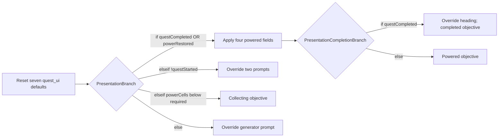

# Restore Power narrative

Open [Restore Power — Unreal C++ Quest Sample](https://arcweave.com/app/project/MWEZgMb62g) in [workspace Z7gAR6XY](https://arcweave.com/app/workspace/Z7gAR6XY/projects). Access requires permission to the workspace or project. The bundled export runs locally without an API key.

Arcweave owns quest decisions, feedback, objectives, interaction prompts, and station labels. Unreal supplies physical events and implements three authored world commands. The project has two boards: **01 · World event flows** has separate, labeled event lanes; **02 · Objectives and interface** selects the current display. The **UI** component folder groups the interface strings by purpose.

## World events

Each entry runs its connected path until an element has no output. A connection means “continue this event now.” Moving between the terminal, pickups, generator, and exit requires another Unreal event, so those lanes are not connected to one another.

| Unreal event | Arcweave entry | Authored behavior |
| --- | --- | --- |
| Start/restart | `InitializationElement` | Shows the opening instruction without accepting the task. |
| Use terminal | `TerminalEntryElement` | Checks completed, powered, and accepted states in order. Otherwise, `StartElement` sets `questStarted = true`. Repeated interactions have their own feedback. |
| Collect a new cell | `PickupEntryElement` | Denies collection before acceptance. Otherwise, `PickupActionElement` requests `collect_cell`, then `PickupCollectedElement` renders the updated count. |
| Use an already collected cell | `DuplicatePickupElement` | Supplies the duplicate-pickup response. Unreal tracks physical item identity. |
| Use generator | `GeneratorElement` | Checks already powered, task not accepted, and sufficient cells in order. Success sets `powerRestored = true` and requests `restore_power` and `open_gate`; otherwise it gives guidance. |
| Enter the exit volume | `ExitEntryElement` | Gives repeat feedback if completed; sets `questCompleted = true` only when power is restored; otherwise denies exit. |

The generator condition is `powerCells >= requiredPowerCells`. Before acceptance, the authored prerequisite wins even if enough cells are present. After power is restored, interacting again reaches an authored review response. Opening the gate does not complete the task: the player must enter the exit.

`UQuestDirector::RunGraph` calls `TranspileObject` for each element, dispatches attached command components, then uses `GetIsTargetBranch` to resolve the next connection against current variables. The `collect_cell` handler records the physical pickup and calls `SetVariable` **before** the following feedback element runs. That element uses:

```arcscript
show("Collected a power cell (", powerCells, "/", requiredPowerCells, ").")
```

Every executed element has nonempty content because the released plugin cannot parse empty elements. Entry and action nodes use short progress text; their final feedback replaces it before the event is published to the HUD.

Command names are component **custom IDs** understood by this sample's C++ registry. They are not built-in Arcscript functions or Unreal Gameplay Tags. `collect_cell` belongs only on `PickupActionElement`, where Unreal has supplied a pending pickup identity. `restore_power` and `open_gate` belong only on `SuccessElement`.

## Five global quest variables

| Variable | New-game value | Meaning and owner |
| --- | --- | --- |
| `questStarted` | `false` | Arcweave marks terminal acceptance. |
| `powerCells` | `0` | Unreal writes the number of unique physical pickups collected. |
| `requiredPowerCells` | `2` | Authored configuration shared by generator conditions, objectives, and count feedback. |
| `powerRestored` | `false` | Arcweave records generator success. |
| `questCompleted` | `false` | Arcweave records arrival at the powered exit. |

The scene contains two pickups. Change `requiredPowerCells` to `1` to try a shorter task; a target above `2` needs additional Unreal pickups. Arcweave Play Mode can exercise the lanes by starting at their entries and changing these variables in the Debugger. Physical collection, lighting, and gate commands execute in Unreal. The UI components add nineteen scoped string variables, giving the imported project **24 runtime variables** in total.

## UI components

The **UI** folder contains three standalone data components:

| Component | Custom ID / C++ binding | String attribute custom IDs |
| --- | --- | --- |
| HUD text | `hud` / `HUDTextComponent` | `brand`, `station_name`, `mission_tagline`, `cells_label`, `station_footer` |
| World text | `world_text` / `WorldTextComponent` | `terminal_label`, `cell_a_label`, `cell_b_label`, `sign_station`, `sign_distribution`, `sign_gate`, `sign_exit` |
| Quest display | `quest_ui` / `QuestUIComponent` | `mission_heading`, `grid_status`, `terminal_prompt`, `cell_prompt`, `generator_prompt`, `generator_label`, `gate_label` |

Each attribute is a plain string with a stable custom ID. Component and attribute labels can change while those custom IDs remain stable. The folder organizes the components without creating another variable scope, and none of these components is attached to an element as a gameplay command.

Arcscript uses names such as `hud.station_name`, `world_text.terminal_label`, and `quest_ui.generator_prompt`. At initialization, C++ maps attribute custom IDs to runtime variable UUIDs. After the presentation path finishes, it caches their current values under qualified keys for the HUD, world labels, and quest display. HUD drawing and focus queries only read that cache.

For example, an event may assign `hud.station_name = "RELAY 08"`. That value appears when the director runs its internal `RefreshPresentation()` after an event, and persists through later presentation refreshes. Restarting restores all authored defaults. Presentation owns `quest_ui.*`, so those seven fields are reset and recomputed on each refresh.

## Objectives and interface

After every event, C++ runs `PresentationEntryElement`, which restores the seven Quest display attributes to their authored defaults. Each call occupies its own Arcscript code block:

- `reset(quest_ui.mission_heading)`
- `reset(quest_ui.grid_status)`
- `reset(quest_ui.terminal_prompt)`
- `reset(quest_ui.cell_prompt)`
- `reset(quest_ui.generator_prompt)`
- `reset(quest_ui.generator_label)`
- `reset(quest_ui.gate_label)`

These defaults describe the collecting state. The connected graph applies small overrides for other states, then ends on one of the five objective leaves. Only `quest_ui.*` is reset; quest progress and HUD/world text overrides survive the refresh.



`PresentationPoweredSetupElement` assigns the online grid status, review-generator prompt, online generator label, and open-gate label once for both powered outcomes. Completed then changes the mission heading to **MISSION COMPLETE**. Unaccepted overrides the terminal and cell prompts; Ready changes only the generator prompt. Collecting and Powered need only their objective content. The final objectives are:

| Condition | Objective |
| --- | --- |
| `questCompleted` | Task complete. You reached the exit. |
| `powerRestored` | Power restored. Walk through the open gate. |
| `!questStarted` | Use the terminal to begin. |
| `powerCells < requiredPowerCells` | Collect power cells (0/2), then use the generator. |
| Otherwise | Return to the generator and restore power. |

The collecting objective renders both numbers with `show()`, using the same variables as the generator condition. The powered and completed displays retain the **Review running generator** prompt so the authored repeat response remains accessible. The leaves carry objective content and their few Arcscript overrides; display fields live on the Quest display component.

Presentation may read known quest and UI variables, show text, and assign the seven `quest_ui.*` fields. Its conditions only read state, and its paths dispatch no command components. The entry's seven individual resets prevent stale display values when moving between states; it never calls `resetAll()`. Refreshing records presentation visits once per execution. The released native plugin requires **one statement per Arcscript code block**; consecutive blocks execute in order. Use separate blocks for the powered setup's four assignments and the unaccepted state's two assignments as well.

## Files and editing

- `Narrative/bindings.json` and `Source/ArcweaveQuest/QuestBindings.h` identify the entry points, feedback/display leaves, global variables, three UI components, and command components used by C++ or its tests. Conditions, connections, notes, and attributes retain their IDs in the graph without becoming C++ bindings.
- `Narrative/project.json` records the online project/workspace, export URLs, export time, and SHA-256 checksums. It contains no credential.
- `Narrative/import.json` reproduces this graph and its board layout using the all-locales authoring export plus coordinates from the Unreal export. Importing its `project` creates a separate project; it does not update the linked one.
- `Narrative/authoring.json` is the actual Arcweave JSON API export. That endpoint omits coordinates.
- `Content/ArcweaveExport/quest.json` is the actual Unreal API response, including its `project` envelope and layout. It is the only JSON file in that import directory.

Keep the bound IDs, command and UI custom IDs, and variable meanings when editing. Text, attribute defaults, conditions, notes, node positions, and internal automatic paths can change without adding C++ bindings. Automatic paths must remain acyclic, stay within one board, and have at most one output per element. Each condition row has exactly one outgoing connection; use separate condition rows for separate outcomes. Changing the event interface, supported commands, or presentation contract requires corresponding C++ changes.

## Refresh the bundled narrative

Use Python 3.9 or later and an API key with **Read projects** access to the sample. Keep its token file outside the repository:

```bash
python Scripts/sync-narrative.py --token-file "/path/outside/repository/arcweave-token.txt"
```

The script downloads both exports from `https://arcweave.com` and validates them before replacing either file. It checks required bindings, five global variables and their new-game defaults, the three UI components and their nineteen strings, graph connections and cycles, separate world-event entries, nonempty executable content, and command placement. Presentation checks require the seven unconditional entry resets, one statement per code block, read-only conditions, and writes restricted to known `quest_ui.*` fields. New designer notes and internal graph objects do not require bindings. It updates export checksums, does not edit online projects, and never stores or prints the key. Two requests count against the workspace's import/export rate limit; on HTTP 429, wait for the reported interval and rerun. The layout-preserving `import.json` is maintained separately as a reproducible snapshot.

Run `python Scripts/test-sync-narrative.py` to check the bundled exports and validator regressions offline, without an API key.

For an editor run, press **R** to restart the mission after syncing, or start a new Play session. This reloads the local export. For an existing packaged build, also copy the refreshed `quest.json` into `Builds/Windows/ArcweaveQuest/Content/ArcweaveExport/` before restarting; packaging again includes it automatically. Text and condition edits do not require recompiling C++. This sample uses the released Unreal plugin v2.1.0.
