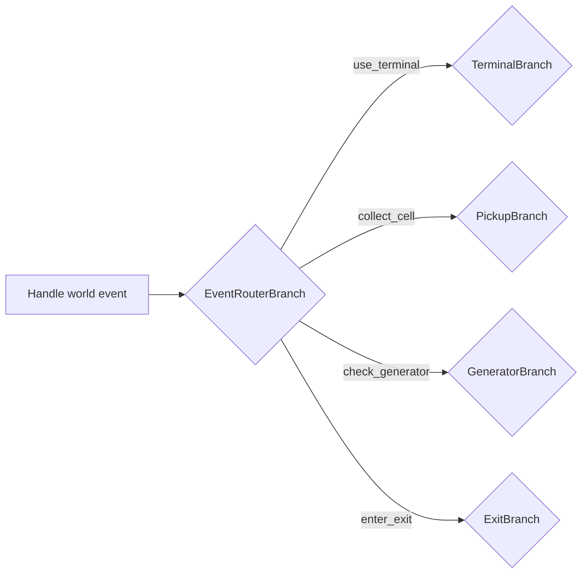
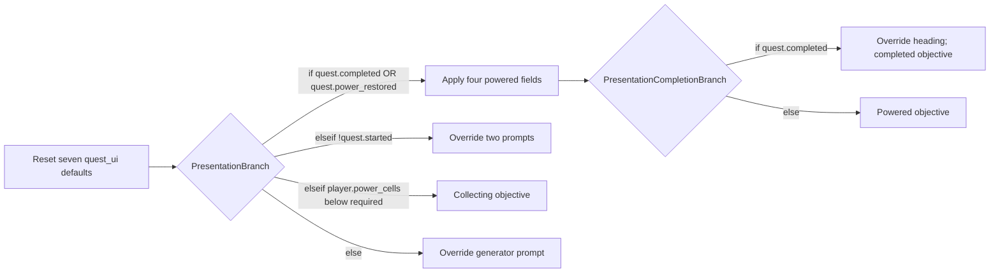

# Restore Power narrative

Open [Restore Power — Unreal C++ Quest Sample](https://arcweave.com/app/project/MWEZgMb62g) in [workspace Z7gAR6XY](https://arcweave.com/app/workspace/Z7gAR6XY/projects). Access requires permission to the workspace or project. The bundled export runs locally without an API key.

Arcweave owns quest decisions, feedback, objectives, interaction prompts, and station labels. Unreal supplies physical events and implements two authored world commands. The project has two boards: **01 · World event flows** connects one shared entry and event-routing branch to four labeled interaction lanes; **02 · Objectives and interface** selects the current display. Four component folders separate **State**, interaction **Inputs**, engine **Actions**, and **UI** strings.

## World events

Unreal writes the two current interaction inputs on **Inputs → Game event**, then reads `GetArcweaveProjectData().StartingElementId` and executes the authored project starting element (**Handle world event**). There is no fixed C++ binding for this entry. Its single output leads to `EventRouterBranch`. Each of its four conditions connects directly to that interaction’s condition branch. The router has no else condition: an empty or unsupported event type reaches the existing Unreal integration error path without running a gameplay branch. A connection means “continue this event now.” Each selected path ends at its final response; it does not loop back or run another interaction automatically.

| Event router condition | Destination | Authored behavior |
| --- | --- | --- |
| **IF** `game_event.type == "use_terminal"` | `TerminalBranch` | Checks completed, powered, and accepted states in order. Otherwise, **Terminal · accept task** (`StartElement`) sets `quest.started = true`. Repeated interactions have their own feedback. |
| **ELSE IF** `game_event.type == "collect_cell"` | `PickupBranch` | Checks whether that physical cell was already collected, then task acceptance. Only the permitted path requests `collect_cell`; its next element renders the updated count. |
| **ELSE IF** `game_event.type == "check_generator"` | `GeneratorBranch` | Checks already powered, task not accepted, and sufficient cells in order. **Generator · restore power** (`SuccessElement`) sets `quest.power_restored = true` and requests `open_gate`. Unreal reflects that state in the station lighting. Other outcomes give guidance. |
| **ELSE IF** `game_event.type == "enter_exit"` | `ExitBranch` | Gives repeat feedback if completed; sets `quest.completed = true` only when power is restored; otherwise denies exit. |



Every condition row has exactly **one outgoing connection**. The router’s `collect_cell` condition connects directly to `PickupBranch`, whose rows are:

| Pickup condition | Single destination |
| --- | --- |
| **IF** `game_event.cell_already_collected` | `DuplicatePickupElement`: “This power cell has already been collected.” |
| **ELSE IF** `!quest.started` | `PickupTerminalRequiredElement`: “Use the terminal to accept the task first.” |
| **ELSE** | `PickupActionElement`: requests `collect_cell`, then continues to `PickupCollectedElement`. |

Unreal owns the physical identity of each pickup and supplies the duplicate flag. Arcweave owns the check order, collection permission, and response. Both new and repeated pickup requests use the same `collect_cell` event; there is no duplicate-cell event.

Startup and restart load fresh project defaults and execute the entry marked `entry_point = objectives_ui` directly. The initial objective is **Use the terminal to begin.** They do not execute the event entry, emit an arrival message, or accept the task.

## Game event inputs

The **Inputs** folder contains the **Game event** component, with custom ID `game_event`. These attributes describe the current request, independently of quest progress:

| Attribute | Type / default | Meaning |
| --- | --- | --- |
| `type` | Plain string / empty | The interaction being handled: `use_terminal`, `collect_cell`, `check_generator`, or `enter_exit`. |
| `cell_already_collected` | Boolean / `false` | Whether Unreal has already recorded this specific physical pickup. |

`UQuestDirector::RunEvent` replaces **both** inputs before executing the shared entry. Non-pickup events set the duplicate flag to `false`; pickup requests set it from the collected-cell ID set. The inputs retain the latest request until the next interaction and reset with a new game. An empty `type` means no request has been supplied. If manually executed with an empty or unknown value, no router condition matches. Unreal reports “The authored branch has no destination.” without changing quest progress or running world commands. Arcweave exports the empty plain string as JSON `null`, which the bundled Unreal plugin imports as an empty string.

Keep **Handle world event** selected as the project starting element in Arcweave. The sync validator checks that this element belongs to the world-event board and connects directly to the event router. Its UUID may change without changing C++ bindings. The objectives/UI entry is identified by element metadata, as described below.

For Arcweave Play Mode, set `game_event.type` in the Debugger to the interaction you want to simulate, set the duplicate flag as appropriate, and run **Handle world event**. To simulate the next interaction, change the inputs and replay that entry. Unreal implements physical collection and gate commands, and reflects `quest.power_restored` in the station lighting. Play Mode does not implement these physical effects.

## Runtime execution

The generator condition is `player.power_cells >= quest.required_power_cells`. Before acceptance, the authored prerequisite wins even if enough cells are present. After power is restored, interacting again reaches an authored review response. Opening the gate does not complete the task: the player must enter the exit.

`UQuestDirector::RunGraph` calls `TranspileObject` for each element, dispatches attached command components, then uses `GetIsTargetBranch` to resolve connections against current variables. It follows consecutive branches, so the event router can reach the terminal, pickup, generator, or exit condition branch directly. The `collect_cell` handler records the physical pickup and calls `SetVariable` **before** the following feedback element runs. That element uses:

```arcscript
show("Collected a power cell (", player.power_cells, "/", quest.required_power_cells, ").")
```

Every executed element has nonempty content because the bundled plugin cannot parse empty elements. The shared entry and action nodes use short progress text; their final feedback replaces it before the event is published to the HUD.

Command names are component **custom IDs** understood by this sample's C++ registry. They are not built-in Arcscript functions or Unreal Gameplay Tags. `collect_cell` belongs only on `PickupActionElement`, where Unreal has supplied a pending pickup identity. `open_gate` belongs only on `SuccessElement`. These two action components live in the **Actions** folder. Referencing one requests an engine operation; it does not prove the operation completed. Data components are not attached as commands.

## State components

The **State** folder contains **Player** (custom ID `player`) and **Restore power quest** (custom ID `quest`). The project has no global variables. Their attributes describe player or quest state and configuration:

| Variable | New-game value | Meaning and owner |
| --- | --- | --- |
| `player.power_cells` | `0` | Unreal writes the number of unique physical pickups collected. |
| `quest.started` | `false` | Arcweave marks terminal acceptance. |
| `quest.power_restored` | `false` | Arcweave records generator success; Unreal observes this value for station lighting. |
| `quest.completed` | `false` | Arcweave records arrival at the powered exit. |
| `quest.required_power_cells` | `2` | Authored configuration shared by generator conditions, objectives, and count feedback. |

The director seeds a read cache of these five values from the imported project and subscribes once to the plugin’s `OnArcweaveVariableChanged` delegate. Arcscript changes and `SetVariable` update the cache synchronously; repeated state getters do not copy the project or execute narrative code. Restart reseeds authored defaults, and subsystem shutdown removes the subscription. The cache never writes state back to Arcweave.

The scene contains two pickups. Change `quest.required_power_cells` to `1` to try a shorter task; a target above `2` needs additional Unreal pickups. The UI components add nineteen scoped string variables and Game event adds two interaction inputs, giving the imported project **26 runtime variables**, all component attributes.

Use a variable for a fact, configuration value, or text that Arcscript or Unreal reads. Use a referenced **Actions** component to request an engine operation at that point in the flow. An engine action can update a state variable with its result: `collect_cell` records a physical pickup, then updates `player.power_cells` before Arcweave displays the count. `quest.power_restored` is sufficient for the lighting state, so there is no separate restore-power command or mirrored C++ flag. The gate remains an explicit `open_gate` request, allowing its timing to be authored independently.

```text
Components
├── State
│   ├── Player
│   └── Restore power quest
├── Inputs
│   └── Game event
├── Actions
│   ├── Collect cell
│   └── Open gate
└── UI
    ├── HUD text
    ├── World text
    └── Quest display
```

Folders organize the editor; they do not add a variable scope. State, Inputs, and UI components are data containers and do not need references on elements for their variables to be available to Arcscript.

## UI components

The **UI** folder contains three standalone data components:

| Component | Custom ID / C++ binding | String attribute custom IDs |
| --- | --- | --- |
| HUD text | `hud` / `HUDTextComponent` | `brand`, `station_name`, `mission_tagline`, `cells_label`, `station_footer` |
| World text | `world_text` / `WorldTextComponent` | `terminal_label`, `cell_a_label`, `cell_b_label`, `sign_station`, `sign_distribution`, `sign_gate`, `sign_exit` |
| Quest display | `quest_ui` / `QuestUIComponent` | `mission_heading`, `grid_status`, `terminal_prompt`, `cell_prompt`, `generator_prompt`, `generator_label`, `gate_label` |

Each attribute is a plain string with a stable custom ID. Component and attribute labels can change while those custom IDs remain stable. The folder organizes the components without creating another variable scope, and none of these components is attached to an element as a gameplay command.

Arcscript uses names such as `hud.station_name`, `world_text.terminal_label`, and `quest_ui.generator_prompt`. At initialization, C++ maps attribute custom IDs to runtime variable UUIDs. After the presentation path finishes, it caches their current values under qualified keys for the HUD, world labels, and quest display. HUD drawing and focus queries only read that cache.

For example, an event may assign `hud.station_name = "RELAY 08"`. That value appears when the director runs its internal `RefreshPresentation()` after an event, and persists through later presentation refreshes. Restarting restores all authored defaults. Presentation owns `quest_ui.*`, so those seven fields are reset and recomputed on each refresh.

## Objectives and interface

The board with custom ID `quest_presentation` has exactly one entry element with an attribute **named** `entry_point`, whose value is the plain string `objectives_ui`. Element attributes currently have no custom IDs, so keep this attribute name and value stable. The director resolves its element ID once when importing or restarting the project, then caches it. The element and marker UUIDs can change without updating C++ bindings. This attribute identifies the graph entry; it does not create a runtime variable or hold display text.

At startup and after every successful event, C++ runs that entry, which restores the seven Quest display attributes to their authored defaults. Each call occupies its own Arcscript code block:

- `reset(quest_ui.mission_heading)`
- `reset(quest_ui.grid_status)`
- `reset(quest_ui.terminal_prompt)`
- `reset(quest_ui.cell_prompt)`
- `reset(quest_ui.generator_prompt)`
- `reset(quest_ui.generator_label)`
- `reset(quest_ui.gate_label)`

These defaults describe the collecting state. The connected graph applies small overrides for other states, then ends on one of the five objective leaves. Only `quest_ui.*` is reset; quest progress, event inputs, and HUD/world text overrides survive the refresh.



`PresentationPoweredSetupElement` assigns the online grid status, review-generator prompt, online generator label, and open-gate label once for both powered outcomes. Completed then changes the mission heading to **MISSION COMPLETE**. Unaccepted overrides the terminal and cell prompts; Ready changes only the generator prompt. Collecting and Powered need only their objective content. The final objectives are:

| Condition | Objective |
| --- | --- |
| `quest.completed` | Task complete. You reached the exit. |
| `quest.power_restored` | Power restored. Walk through the open gate. |
| `!quest.started` | Use the terminal to begin. |
| `player.power_cells < quest.required_power_cells` | Collect power cells (0/2), then use the generator. |
| Otherwise | Return to the generator and restore power. |

The collecting objective renders both numbers with `show()`, using the same variables as the generator condition. The powered and completed displays retain the **Review running generator** prompt so the authored repeat response remains accessible. The leaves carry objective content and their few Arcscript overrides; display fields live on the Quest display component.

Presentation may read known quest, event, and UI variables, show text, and assign the seven `quest_ui.*` fields. Its conditions only read state, and its paths dispatch no command components. The entry's seven individual resets prevent stale display values when moving between states; it never calls `resetAll()`. Refreshing records presentation visits once per execution. The bundled native plugin requires **one statement per Arcscript code block**; consecutive blocks execute in order. Use separate blocks for the powered setup's four assignments and the unaccepted state's two assignments as well.

## Files and editing

- `Narrative/bindings.json` and `Source/ArcweaveQuest/QuestBindings.h` identify the event-routing branch, interaction lanes, pickup branch, feedback/display leaves, two State components and their five attributes, three UI components, Game event component and its two input attributes, and two command components used by C++ or its tests. The world-event entry comes from the export’s `startingElement` field; the objectives/UI entry comes from its `entry_point` metadata. Neither entry has a fixed binding. Other conditions, connections, notes, and attributes retain their IDs in the graph without becoming C++ bindings.
- `Narrative/project.json` records the online project/workspace, export URLs, export time, and SHA-256 checksums. It contains no credential.
- `Narrative/import.json` reproduces this graph and its board layout using the all-locales authoring export plus coordinates from the Unreal export. Importing its `project` creates a separate project; it does not update the linked one.
- `Narrative/authoring.json` is the actual Arcweave JSON API export. That endpoint omits coordinates.
- `Content/ArcweaveExport/quest.json` is the actual Unreal API response, including its `project` envelope and layout. It is the only JSON file in that import directory.

Keep the bound IDs, command and data-component custom IDs, event names, variable meanings, and objectives/UI entry marker when editing. Text, attribute defaults, conditions, notes, node positions, and internal automatic paths can change without adding C++ bindings. Automatic paths must remain acyclic, stay within one board, and have at most one output per element. Each condition row has exactly one outgoing connection; use separate condition rows for separate outcomes. Changing the event interface, supported commands, or presentation contract requires corresponding C++ changes.

## Refresh the bundled narrative

Use Python 3.9 or later and an API key with **Read projects** access to the sample. Keep its token file outside the repository:

```bash
python Scripts/sync-narrative.py --token-file "/path/outside/repository/arcweave-token.txt"
```

The script downloads both exports from `https://arcweave.com` and validates them before replacing either file. It checks required bindings, the two State components and their five typed attributes and new-game defaults, absence of global variables, the three UI components and their nineteen strings, the Game event component and its two typed inputs, graph connections and cycles, the authored starting element and four router conditions pointing directly to their branches, absence of an else route, pickup check order, nonempty executable content, one statement per executable code block on both boards, and command placement. The shared entry and denied-pickup nodes must produce feedback only; the routed interaction lanes remain separate downstream of the router. Presentation checks require the unique `quest_presentation` board and plain-string `entry_point = objectives_ui` marker, the seven unconditional entry resets, one statement per code block, read-only conditions, and writes restricted to known `quest_ui.*` fields. New designer notes and internal graph objects do not require bindings. It updates export checksums, does not edit online projects, and never stores or prints the key. Two requests count against the workspace's import/export rate limit; on HTTP 429, wait for the reported interval and rerun. The layout-preserving `import.json` is maintained separately as a reproducible snapshot.

Run `python Scripts/test-sync-narrative.py` to check the bundled exports and validator regressions offline, without an API key.

For an editor run, press **R** to restart the mission after syncing, or start a new Play session. This reloads the local export. For an existing packaged build, also copy the refreshed `quest.json` into `Builds/Windows/ArcweaveQuest/Content/ArcweaveExport/` before restarting; packaging again includes it automatically. Text and condition edits do not require recompiling C++. This sample pins plugin main commit `7513d9e113f4b8bca56e662fdb736fb41cb933ba`, including the merged starting-element API.
