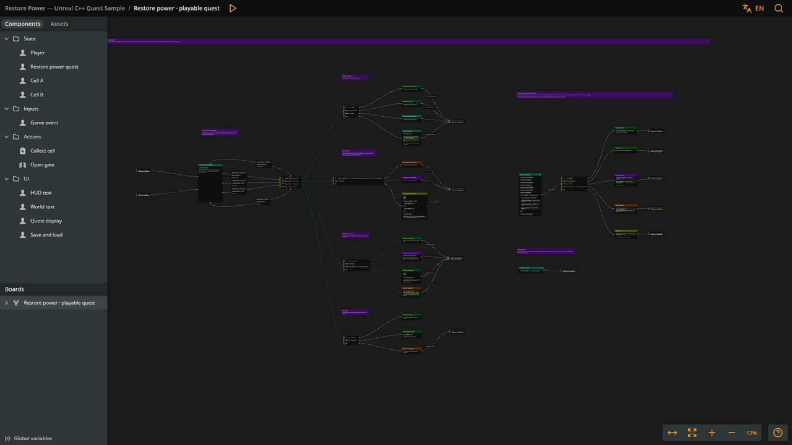
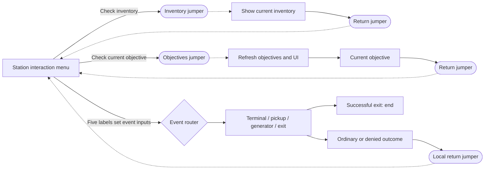
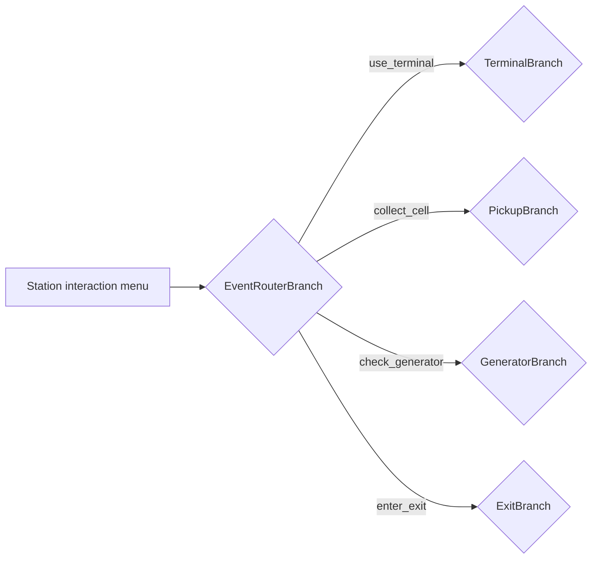
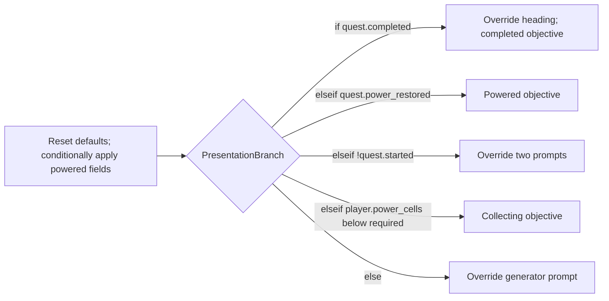

# Restore Power narrative

Explore the public [Restore Power — Unreal C++ Quest Sample](https://arcweave.com/app/project/MWEZgMb62g) or open [Play Mode](https://arcweave.com/app/project/MWEZgMb62g/play). To edit the narrative, import your own copy as described below. The bundled export runs locally without an API key.

Arcweave owns quest progression, feedback, objectives, interaction prompts, station labels, and save/load interface text. Unreal supplies physical events and implements the authored open-gate command. The single **Restore power · playable quest** board contains the station menu, event router, four interaction lanes, inventory query, and objectives/UI path. The complete mission is playable in Arcweave Play Mode and drives the Unreal level from the same conditions and state changes. Four component folders separate **State**, interaction **Inputs**, engine **Actions**, and **UI** strings.



## Import your own copy

1. In your Arcweave workspace, choose **Import project**, select JSON import, and upload [`Narrative/import.json`](../Narrative/import.json). This creates a separate editable project with the sample's board layout, components, and translations.
2. Edit your copy while keeping the [named game interface](#name-based-integration).
3. [Export it for Unreal](#refresh-the-bundled-narrative), either manually from Arcweave or through the REST API, and replace `Content/ArcweaveExport/quest.json` in this repository.

Press **R** in Unreal or start a new Play session to reload the export. No API key is needed for a manual export, and text or condition changes do not require a C++ rebuild. Changed narrative content makes existing checkpoints incompatible, so start a new mission and save again.

## Play Mode and Unreal

Open [Play Mode](https://arcweave.com/app/project/MWEZgMb62g/play) at **Station · choose an interaction**. The menu offers seven choices:

| Choice | Path |
| --- | --- |
| **Check inventory** | Jumper to the current inventory, then **Back to station**. |
| **Check current objective** | Jumper to the objectives/UI path, then **Back to station**. |
| **Use the terminal** | Terminal response, then return to Station. |
| **Collect cell A** / **Collect cell B** | Pickup response, then return to Station. |
| **Check the generator** | Generator response, then return to Station. |
| **Enter the exit** | Denied: return to Station. Completed: end the playthrough. |

Inventory and objective checks are optional: they read current progress without advancing the quest or changing the latest event inputs. Try denied interactions before accepting the task, repeat a pickup, restore power, and complete the escape in the same playthrough. Play Mode's restart control restores authored defaults; no Debugger setup is needed.

The station menu is the project starting element. Its first two connections are query choices with visible labels and no Arcscript assignments; each targets a jumper. The other five labels supply `game_event.type` and `game_event.cell_id` before targeting the same event router. For example, the cell A label sets these inputs in separate code blocks:

```arcscript
game_event.type = "collect_cell"
```

```arcscript
game_event.cell_id = "cell_a"
```

Play Mode uses the selected interaction label's values to evaluate the destination branch and commits those changes when the choice is selected. Unreal already knows which physical interaction occurred: it writes the same inputs and finds the menu's common branch destination, skipping the query jumpers and executing no menu labels. The menu is the only element with multiple outgoing connections; every branch condition still has one output.



All paths share one board. Four local return jumpers serve the terminal, pickup, generator, and denied-exit outcomes. The successful and already-completed exit elements have no outgoing connections. Inventory has one return jumper, and each of the five objective outcomes has its own nearby return jumper. With the menu's two query jumpers, the board has twelve jumpers. Every return targets the current station menu.

The native world-event runner resolves its return jumper and stops **before** executing the station menu, or ends at a completed-exit element. `RunEvent` then calls `RefreshPresentation()` once in either case. Presentation also stops before executing the menu. Unreal's HUD therefore updates automatically after every interaction; it never requires selecting **Check inventory** or **Check current objective**. Play Mode returns control to the menu so the player can choose whether to check progress or interact again. Individual automatic paths remain acyclic up to the menu boundary.

Collection progress is authored state, so Play Mode needs no replacement C++ handler: an accepted pickup marks its cell and increments the inventory in Arcscript. Unreal reads the collected flags to hide pickups and uses an action reference to open the gate; Play Mode shows the authored outcomes without rendering those physical effects. There is no simulation flag, additional board, or separate preview copy of the quest state.

## World events

Unreal writes the two current interaction inputs on **Inputs → Game event**, then uses `GetArcweaveProjectData().StartingElementId` to find the station menu and its common `EventRouterBranch` destination among the five interaction connections. The two query connections target jumpers and are skipped. There is no fixed C++ binding for the station entry. Each of the router's four conditions connects directly to that interaction's condition branch. The router has no else condition: an empty or unsupported event type supplied by Unreal reaches the existing integration error path without running a gameplay branch. In Play Mode, the selected interaction label supplies a supported event before the router is evaluated. Responses return to Station through their group's local jumper; completed-exit responses end the playthrough.

| Event router condition | Destination | Authored behavior |
| --- | --- | --- |
| **IF** `game_event.type == "use_terminal"` | `TerminalBranch` | Checks completed, powered, and accepted states in order. Otherwise, **Terminal · accept task** (`TerminalAcceptElement`) sets `quest.started = true`. Repeated interactions have their own feedback. |
| **ELSE IF** `game_event.type == "collect_cell"` | `PickupBranch` | Checks the selected cell's shared collected state, then task acceptance. One accepted-pickup element marks that cell, increments `player.power_cells`, renders the updated count, and lets Unreal update pickup visibility from the collected flag. |
| **ELSE IF** `game_event.type == "check_generator"` | `GeneratorBranch` | Checks already powered, task not accepted, and sufficient cells in order. **Generator · restore power** (`SuccessElement`) sets `quest.power_restored = true` and requests `open_gate`. Unreal reflects that state in the station lighting. Other outcomes give guidance. |
| **ELSE IF** `game_event.type == "enter_exit"` | `ExitBranch` | Gives repeat feedback if completed; sets `quest.completed = true` only when power is restored; otherwise denies exit. Successful and already-completed responses end Play Mode; a denied exit returns to Station. |



Every condition row has exactly **one outgoing connection**. The router’s `collect_cell` condition connects directly to `PickupBranch`, whose rows are:

| Pickup condition | Single destination |
| --- | --- |
| **IF** the selected cell's `collected` flag is true | `DuplicatePickupElement`: “This power cell has already been collected.” |
| **ELSE IF** `!quest.started` | `PickupTerminalRequiredElement`: “Use the terminal to accept the task first.” |
| **ELSE** | `PickupActionElement`: updates the selected cell and inventory, displays the updated count, and lets Unreal update pickup visibility from the collected flag. |

The pickup condition compares `game_event.cell_id` with `cell_a` or `cell_b` and reads the corresponding component's `collected` flag. Arcweave owns the check order, collection permission, unique collection state, and response. Both new and repeated pickup requests use the same `collect_cell` event; there is no duplicate-cell event or externally supplied duplicate flag. Unreal's physical pickup IDs match those used by the two menu choices.

Unreal startup and restart load fresh project defaults and execute the entry marked `entry_point = objectives_ui` directly, stopping before the menu. The initial objective is **Use the terminal to begin.** They do not execute a world event, emit an arrival message, or accept the task. Browser Play Mode starts at the station menu and lets the player choose the first interaction.

## Game event inputs

The **Inputs** folder contains the **Game event** component, with custom ID `game_event`. These attributes describe the current request, independently of quest progress:

| Attribute | Type / default | Meaning |
| --- | --- | --- |
| `type` | Plain string / empty | The interaction being handled: `use_terminal`, `collect_cell`, `check_generator`, or `enter_exit`. |
| `cell_id` | Plain string / empty | The selected pickup: `cell_a` or `cell_b`; empty for other interactions. |

`UQuestDirector::RunEvent` replaces **both** inputs before following the shared router. Non-pickup events clear `cell_id`; pickup requests supply the physical cell's matching ID. Play Mode's five interaction labels replace both fields in the same way. Its two query labels leave them unchanged. The inputs retain the latest request until the next interaction and reset with a new game. An empty `type` means no request has been supplied. If the router is directly executed with an empty or unknown value, no condition matches. Unreal reports “The authored branch has no destination.” without changing quest progress or running world commands. Arcweave exports empty plain strings as JSON `null`, which the bundled Unreal plugin imports as empty strings.

Keep the station menu selected as the project starting element in Arcweave, with its seven menu outputs: two query jumpers and five supported input assignments sharing the event-router target. Its ID may change without changing C++. Inventory and objectives/UI entries are identified by element metadata on the same board, as described below.

## Name-based integration

The game uses the same qualified names as Arcscript: `quest.started`, `player.power_cells`, `cell_a.collected`, `game_event.type`, and the UI fields below. After loading, the director resolves these names from the plugin's imported variable scopes and names, then caches the mapping internally. Event writes and state/UI reads use this map. Component and attribute custom IDs define the interface; their display labels can change.

There is no UUID configuration or generated binding header. The starting element comes from the export, query entries use `entry_point` metadata, and the gate action is dispatched by its `open_gate` custom ID. A copied project may use different object IDs while keeping this named interface. The integration and plugin still use the export's internal IDs to traverse connections and capture snapshots; changing the imported content still makes old checkpoints incompatible.

Native automation identifies expected response elements by their unique authored titles. These are test expectations, independent of the route being checked; the game does not look up response titles. If renaming those sample outcomes, update the title expectations in [`QuestTestNarrative.h`](../Source/ArcweaveQuest/Tests/QuestTestNarrative.h). The tests retain the sample's quest contract without requiring any copied UUIDs.

## Runtime execution

The generator condition is `player.power_cells >= quest.required_power_cells`. Before acceptance, the authored prerequisite wins even if enough cells are present. After power is restored, interacting again reaches an authored review response. Opening the gate does not complete the task: the player must enter the exit.

`UQuestDirector::RunGraph` calls `TranspileObject` for each element, dispatches attached command components, then uses `GetIsTargetBranch` to resolve connections against current variables. It follows consecutive branches, so the event router can reach the terminal, pickup, generator, or exit condition branch directly. On an accepted pickup, `PickupActionElement` marks `cell_a.collected` or `cell_b.collected`, increments `player.power_cells`, and renders the count. When the interaction completes, Unreal reads the collected flags to hide the corresponding pickup and disable its collision. No pickup action reference or separate Unreal collection state is needed. The final code block shows the updated inventory in both runtimes:

```arcscript
show("Collected a power cell (", player.power_cells, "/", quest.required_power_cells, ").")
```

Every executed element has nonempty content because the bundled plugin cannot parse empty elements. Action elements contain their player-facing feedback alongside their Arcscript. In Play Mode, the accepted pickup shows the count immediately, then returns through the pickup group's station jumper. Choosing **Check current objective** enters presentation, whose authored **See current objective** continuation selects the objective. Branch-condition connections have no labels, preserving the menu choice's label as Play Mode follows the branch chain. The native runner does not replace event feedback with the menu or objective text when it reaches a boundary; the objective is published separately after its automatic presentation refresh.

The **Actions** folder contains **Open gate**, custom ID `open_gate`, referenced only on `SuccessElement`. The sample's C++ command registry opens the physical gate after that element's Arcscript runs. Its rich-text **Description** attribute explains the effect, where to reference it, execution order, and Play Mode behavior. This is author documentation and adds no runtime variable. Command custom IDs are understood by this sample; they are not built-in Arcscript functions or Unreal Gameplay Tags. Data components remain standalone and are not attached as commands.

## State components

The **State** folder contains **Player** (custom ID `player`), **Restore power quest** (custom ID `quest`), **Cell A** (`cell_a`), and **Cell B** (`cell_b`). The project has no global variables. Their attributes describe shared gameplay state and configuration:

| Variable | New-game value | Meaning and owner |
| --- | --- | --- |
| `player.power_cells` | `0` | Arcscript increments the count after an accepted, unique pickup. |
| `quest.started` | `false` | Arcweave marks terminal acceptance. |
| `quest.power_restored` | `false` | Arcweave records generator success; Unreal observes this value for station lighting. |
| `quest.completed` | `false` | Arcweave records arrival at the powered exit. |
| `quest.required_power_cells` | `2` | Authored configuration shared by generator conditions, objectives, and count feedback. |
| `cell_a.collected` | `false` | Arcscript records whether cell A was collected; duplicate checks read this value in both runtimes, and Unreal uses it for pickup visibility and collision. |
| `cell_b.collected` | `false` | Arcscript records whether cell B was collected; duplicate checks read this value in both runtimes, and Unreal uses it for pickup visibility and collision. |

The director seeds a read cache of all seven player, quest, and cell values from the imported project and subscribes once to the plugin's `OnArcweaveVariableChanged` delegate. Arcscript changes and `SetVariable` update the cache synchronously; repeated state getters do not copy the project or execute narrative code. `OnArcweaveStateRestored` reseeds the cache when loading a snapshot, because restoration does not emit variable-change events. The pickup branch and Unreal's `HasCollectedCell` read the same collected flags. After each interaction, restart, or load, the world applies those flags to pickup visibility and collision. The cache never writes state back to Arcweave.

The scene and menu contain two pickups. Change `quest.required_power_cells` to `1` to try a shorter task; a target above `2` needs additional authored cell state and menu choices, as well as Unreal pickups. The UI components add twenty-seven scoped string variables and Game event adds two interaction inputs, giving the imported project **36 runtime variables** across nine data components. The Open gate action and its rich-text description add no runtime variables.

Use a variable for a fact, configuration value, or text that Arcscript or Unreal reads. World objects can reflect that state directly: collected flags control pickup visibility and `quest.power_restored` controls station lighting. Use a referenced **Actions** component when the flow should explicitly request an engine operation at a particular point. The gate remains an `open_gate` request, allowing its timing to be authored independently.

```text
Components
├── State
│   ├── Player
│   ├── Restore power quest
│   ├── Cell A
│   └── Cell B
├── Inputs
│   └── Game event
├── Actions
│   └── Open gate
└── UI
    ├── HUD text
    ├── World text
    ├── Quest display
    └── Save and load
```

Folders organize the editor; they do not add a variable scope. State, Inputs, and UI components are data containers and do not need references on elements for their variables to be available to Arcscript.

## UI components

The **UI** folder contains four standalone data components:

| Component | Custom ID | String attribute custom IDs |
| --- | --- | --- |
| HUD text | `hud` | `brand`, `station_name`, `mission_tagline`, `cells_label`, `station_footer`, `controls` |
| World text | `world_text` | `terminal_label`, `cell_a_label`, `cell_b_label`, `sign_station`, `sign_distribution`, `sign_gate`, `sign_exit` |
| Quest display | `quest_ui` | `mission_heading`, `grid_status`, `terminal_prompt`, `cell_prompt`, `generator_prompt`, `generator_label`, `gate_label` |
| Save and load | `save_ui` | `controls`, `saved`, `loaded`, `no_save`, `save_failed`, `load_failed`, `incompatible_save` |

Each attribute is a plain string with a stable custom ID. Component and attribute labels can change while those custom IDs remain stable. The folder organizes the components without creating another variable scope, and none of these components is attached to an element as a gameplay command.

Arcscript uses names such as `hud.station_name`, `world_text.terminal_label`, and `quest_ui.generator_prompt`. At initialization, the integration resolves qualified custom IDs to the plugin's internal variable IDs. After the presentation path finishes, it caches their current values under qualified keys for the HUD, world labels, quest display, and save/load panel. HUD drawing and focus queries only read that cache.

For example, an event may assign `hud.station_name = "RELAY 08"`. That value appears when the director runs its internal `RefreshPresentation()` after an event, and persists through later presentation refreshes. Restarting restores all authored defaults. Movement and interaction instructions live in `hud.controls`; checkpoint controls and operation feedback live in `save_ui`. Edit these strings to change the displayed instructions without changing C++. Actual input mappings remain in `Config/DefaultInput.ini`. Presentation owns `quest_ui.*`, so those seven fields are reset and recomputed on each refresh.

## Inventory query

The inventory element is identified by a plain-string element attribute **named** `entry_point`, with value `inventory`. **Check inventory** targets a jumper to this element, which displays the authored label and current collected count:

```arcscript
show(hud.cells_label, ": ", player.power_cells)
```

For example, after collecting one cell it shows **POWER CELLS: 1**. The quest's required count belongs in the objective. This element only reads variables; it does not change event inputs or gameplay state, update UI fields, or dispatch action components. Its single continuation reaches a local jumper back to Station. The metadata and jumper target identify it without a fixed C++ identifier. Unreal already shows the current inventory in its HUD, so it does not need to execute this optional Play Mode query after an interaction.

## Objectives and interface

The same board as the station menu has exactly one objectives/UI entry element with an attribute **named** `entry_point`, whose value is the plain string `objectives_ui`. Element attributes currently have no custom IDs, so keep this attribute name and value stable. The director resolves its element ID once when importing or restarting the project, then caches it. The element and marker IDs can change without updating C++. This attribute identifies the presentation entry; it does not create a runtime variable or hold display text. There is no separate presentation board.

**Check current objective** connects to a jumper targeting this entry. Play Mode follows that choice only when the player requests it. Unreal calls `RefreshPresentation()` directly once after every interaction, including a successful exit, and on startup or restart. This refresh is a separate native call after the event flow finishes. The entry first restores the seven Quest display attributes to their authored defaults. Each call occupies its own Arcscript code block:

- `reset(quest_ui.mission_heading)`
- `reset(quest_ui.grid_status)`
- `reset(quest_ui.terminal_prompt)`
- `reset(quest_ui.cell_prompt)`
- `reset(quest_ui.generator_prompt)`
- `reset(quest_ui.generator_label)`
- `reset(quest_ui.gate_label)`

These unconditional defaults describe the collecting state. The same entry then checks `if quest.completed || quest.power_restored` and applies four shared powered-state fields: online grid status, review-generator prompt, online generator label, and open-gate label. Its visible summary uses the authored mission heading; the inventory query handles the separate inventory display. The `if`, each assignment, `endif`, and `show()` occupy separate code blocks. This keeps the shared powered fields in one place while a single board branch selects the current objective.

That branch connects directly to the completed, powered, unaccepted, collecting, and ready leaves. Each leaf connects to its own nearby jumper whose target is the station menu. Play Mode follows that target; the native presentation runner resolves it and stops before executing the menu. These jumpers are local to the same board. Only `quest_ui.*` is reset; quest progress, collected-cell state, event inputs, and HUD/world/save text overrides survive the refresh.



Completed changes the mission heading to **MISSION COMPLETE**. Unaccepted overrides the terminal and cell prompts; Ready changes only the generator prompt. Collecting and Powered need only their objective content. The final objectives are:

| Condition | Objective |
| --- | --- |
| `quest.completed` | Task complete. You reached the exit. |
| `quest.power_restored` | Power restored. Walk through the open gate. |
| `!quest.started` | Use the terminal to begin. |
| `player.power_cells < quest.required_power_cells` | Collect power cells (0/2), then use the generator. |
| Otherwise | Return to the generator and restore power. |

The collecting objective renders both numbers with `show()`, using the same variables as the generator condition. The powered and completed displays retain the **Review running generator** prompt so the authored repeat response remains accessible. The leaves carry objective content and their few Arcscript overrides; display fields live on the Quest display component.

Presentation may read known state, event, and UI variables, show text, and assign the seven `quest_ui.*` fields. Its conditions only read state, and its paths dispatch no command components. The entry's seven unconditional resets prevent stale display values when moving between states; it never calls `resetAll()`. Refreshing records presentation visits once per execution. The bundled native plugin requires **one statement per Arcscript code block**; consecutive blocks execute in order. This applies to the entry's conditional powered assignments and the unaccepted state's two assignments as well.

## Save and load

In Unreal, **F5** saves and **F9** loads the single `ArcweaveQuestCheckpoint` slot. The file is `Saved/SaveGames/ArcweaveQuestCheckpoint.sav` under the running game's saved directory. Saving replaces that slot; restarting the mission with **R** leaves it available. After closing and reopening the game, press **F9** to resume. The player starts a fresh mission until they choose to load.

For a demonstration, accept the terminal task, collect one cell, and save. Restore power and reach the exit, then load. The player returns to the saved position and facing direction with one cell, the other pickup available, the gate closed, the station unpowered, and the saved objective and response visible. Saving after power restoration or after completion also restores those stages.

The plugin and sample have separate responsibilities:

| Saved data | Owner |
| --- | --- |
| Every current component variable, including cell flags, UI strings, and event inputs; all visit counters; content fingerprint and snapshot format | Plugin `FArcweaveRuntimeState`, produced by `CaptureState` and consumed by `RestoreState`. |
| Applied gate state | Sample `UQuestSaveGame`, used to restore the effect of the earlier `open_gate` command. Pickup visibility and station power come from the restored collected flags and `quest.power_restored`. |
| Current response and objective element IDs, plus resolved objective and feedback text | Sample `UQuestSaveGame`, so loading does not need to execute either graph. |
| Player transform and view rotation | Sample `UQuestSaveGame`, captured and applied by `AQuestGameMode`. |

[`UQuestDirector::SaveCheckpoint`](../Source/ArcweaveQuest/QuestDirector.cpp) captures the plugin snapshot after the current interaction has finished, adds the game-owned values, and writes a [`UQuestSaveGame`](../Source/ArcweaveQuest/QuestSaveGame.h) in sample save format 2 with `UGameplayStatics::SaveGameToSlot`. The plugin itself does not write files or know the player's location, narrative cursor, or Unreal actors.

`LoadCheckpoint` reads the slot and checks its format, content fingerprint, and game-owned data before asking the plugin to restore the snapshot. The plugin validates all variables and visit counters before changing any state. Its `OnArcweaveStateRestored` delegate refreshes the director's state and text caches from the restored values; it does not issue ordinary variable-change notifications. The director then applies its saved cursors, resolved text, and world-effect state, and publishes the completed checkpoint. `AQuestGameMode::LoadCheckpoint` restores the player's pose, stops movement, and snaps pickup visibility, gate position/collision, and lighting to the restored state. Exit-trigger handling is suppressed during the restore so teleporting the player does not complete the quest again.

Loading does **not** call `TranspileObject`, recompute the objectives/UI graph, increment visits, or replay command components. This is why the save includes resolved objective/feedback text as well as plugin state. The next ordinary interaction resumes the shared event flow and its automatic presentation refresh.

The separate HUD panel below the inventory reads `save_ui.controls` and the latest operation's authored message. Missing saves use `no_save`; failed writes or reads use `save_failed` or `load_failed`; changed content or unsupported formats use `incompatible_save`. Successful operations use `saved` or `loaded`. These are UI strings on **UI → Save and load**, not quest flags or action-component references. Inventory and objective queries may read them but cannot write or reset them. The existing browser Play Mode flow has no file save/load actions.

Snapshots require the same imported project content, not just the same Arcweave project ID. The plugin's fingerprint includes exported text and layout as well as quest rules; JSON whitespace and object-key order do not affect it. After replacing the export with changed narrative content, start a new mission and save again. This sample reports incompatible saves without altering the current mission; migrating snapshots across project versions is outside its scope.

## Files and editing

- `Source/ArcweaveQuest/QuestDirector.cpp` discovers the game interface from qualified custom IDs, the export's starting element, and query entry markers. `Source/ArcweaveQuest/Tests/QuestTestNarrative.h` describes the sample's expected responses with readable titles and custom IDs. No separate UUID binding files are required.
- `Narrative/import.json` is the starter project, including its board layout and translations, ready to upload into your Arcweave workspace. Importing it creates a separate project. Replacing the game's runtime export does not update this starter copy.
- `Content/ArcweaveExport/quest.json` is the game's narrative input. Replace it with your Unreal export as described below. It is the only JSON file in that import directory.

Keep command and data-component custom IDs, event names, variable meanings, and the two query entry markers when editing. Preserve the sample response titles for native automation, or update the test expectations when renaming them. Content, attribute defaults, conditions, notes, node positions, and internal automatic paths can change without adding C++ identifiers. Keep the complete experience on one board. The menu's two query jumpers target the inventory and objectives/UI entries. Four event-group returns, one inventory return, and five objective returns target the current project starting element. Intended loops return from a single interaction or query to the menu; automatic paths before that boundary must remain acyclic. Only the starting menu has multiple outputs: two query jumpers followed by five interactions sharing a router. Other elements have one continuation, except the successful and already-completed exit elements, which end the playthrough. Each condition row has exactly one outgoing connection. Only the five interaction labels assign the two event inputs; query labels do not write variables. Leave branch-condition connection labels empty so they do not replace the selected interaction's text in Play Mode. Changing the event interface, supported commands, or query contracts requires corresponding C++ and test changes.

## Refresh the bundled narrative

The game reads a local Unreal export from `Content/ArcweaveExport/quest.json`. Use either method below to replace it from your own Arcweave workspace.

### Manual export

1. Open your project in Arcweave and choose **Export project**.
2. Select **Engine**, then **Export for Unreal**. If **Language to export** is shown, choose the language to use in the game (English for the bundled sample).
3. Click **Export**, download the ZIP, and extract `project.json`. This sample does not need **Include assets**.
4. Rename the extracted file to `quest.json` and replace `Content/ArcweaveExport/quest.json` in this repository.

### REST API

Use `GET https://arcweave.com/api/v1/PROJECT_HASH/unreal` with an API token that has **Read projects** access to your workspace. The project hash is the part after `/project/` in its Arcweave URL. Set `ARCWEAVE_API_TOKEN` in your shell to your token, replace `PROJECT_HASH` below, and run from the repository root:

```powershell
Invoke-WebRequest -UseBasicParsing `
  -Uri "https://arcweave.com/api/v1/PROJECT_HASH/unreal" `
  -Headers @{ Authorization = "Bearer $env:ARCWEAVE_API_TOKEN"; Accept = "application/json" } `
  -OutFile "Content/ArcweaveExport/quest.json"
```

This exports the project's default language. Append `?locale=en` to request English, or use another locale from your project. Keep the API token outside the repository; the game only needs the downloaded file.

### Load the replacement

The pinned plugin accepts both the manual export's top-level project JSON and the REST response's `project` envelope; no conversion is needed. Keep `quest.json` as the only JSON file in `Content/ArcweaveExport`, with any backups outside that directory.

For an editor run, press **R** to restart the mission, or start a new Play session. This reloads the local export. For an existing packaged build, also replace `Builds/Windows/ArcweaveQuest/Content/ArcweaveExport/quest.json` before restarting; packaging again includes it automatically. Text and condition edits do not require recompiling C++. Updated project content makes existing checkpoints incompatible; start a new mission and save again. Use the [native automation](development.md#native-automation) to check quest behavior after editing.
