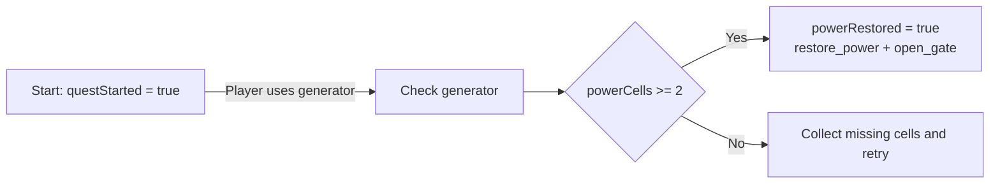

# Restore Power narrative

Open [Restore Power — Unreal C++ Quest Sample](https://arcweave.com/app/project/MWEZgMb62g) in [workspace Z7gAR6XY](https://arcweave.com/app/workspace/Z7gAR6XY/projects). Access requires permission to the workspace or project. The bundled export runs locally without an API key.



Arcweave owns the text, variables, condition, branch connections, and command metadata. C++ owns interaction timing and the world effects. It starts the first element, waits while the player moves and collects cells, and reevaluates the authored branch on each generator interaction. The Start connection documents that progression; the sample does not automatically traverse it immediately after starting.

| Authored item | C++ behavior |
| --- | --- |
| `questStarted`, initially `false` | Start assigns `true` when the quest begins. |
| `powerCells`, initially `0` | Collecting a world pickup calls `SetVariable` with the variable's stable ID. |
| Generator → Power branch | `GetIsTargetBranch` evaluates the authored condition against current variables and returns its selected outgoing connection. |
| Missing-cells element | Displays the retry instruction; the next generator interaction evaluates the branch again. |
| `powerRestored`, initially `false` | Success assigns `true`. |
| Success component `restore_power` | The sample's C++ registry switches on the world lighting. |
| Success component `open_gate` | The sample's C++ registry opens the exit gate. |

The command names are component **custom IDs** attached to Success. They are metadata interpreted by this sample's C++ registry, not built-in Arcscript functions or Unreal Gameplay Tags. Arcweave Play Mode can test the branch by changing `powerCells` in its Debugger; lighting and gate effects run in Unreal.

## Files and stable IDs

- `Narrative/bindings.json` is the shared ID contract used to author and validate the sample.
- `Narrative/project.json` records the online project/workspace, source export URLs, export time, and SHA-256 checksums. It contains no credential.
- `Narrative/import.json` is the original import request, including the readable board layout. Importing its `project` creates a separate project; it does not update the linked one.
- `Narrative/authoring.json` is the actual Arcweave JSON API export. That endpoint omits coordinates; the original layout is retained in `import.json` and the online project.
- `Content/ArcweaveExport/quest.json` is the actual Unreal API response, including its `project` envelope. It is the only JSON file in that import directory.

Keep the bound IDs and command custom IDs when editing the online project. You can edit text and the power-cell condition in Arcweave, then refresh the bundled exports. A graph redesign that changes the expected Generator → branch structure needs corresponding C++ changes.

## Refresh the bundled narrative

Use Python 3.9 or later and an API key with **Read projects** access to the sample. Keep its token file outside the repository:

```bash
python Scripts/sync-narrative.py --token-file "/path/outside/repository/arcweave-token.txt"
```

The script reads the linked project hash, downloads both exports from `https://arcweave.com`, validates their stable IDs and command custom IDs, and updates the checksums. It does not create or edit online projects and never stores or prints the API key. Two export requests count against the workspace's import/export rate limit; if HTTP 429 is returned, wait for the reported interval and rerun.

Rebuild or restart the sample after syncing so it imports the updated narrative. This sample uses the released Unreal plugin v2.1.0.
